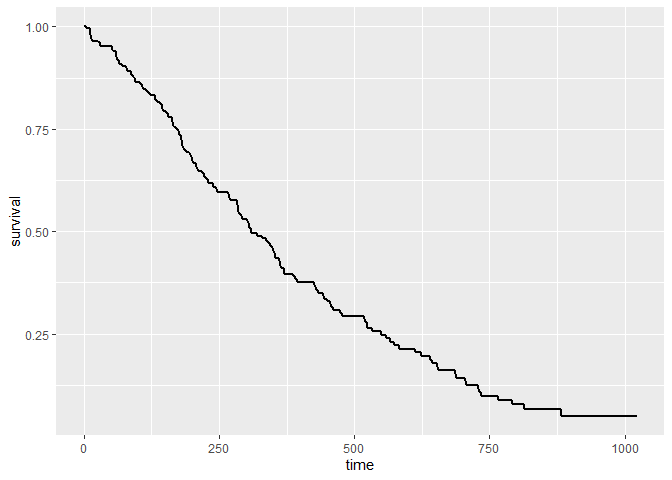
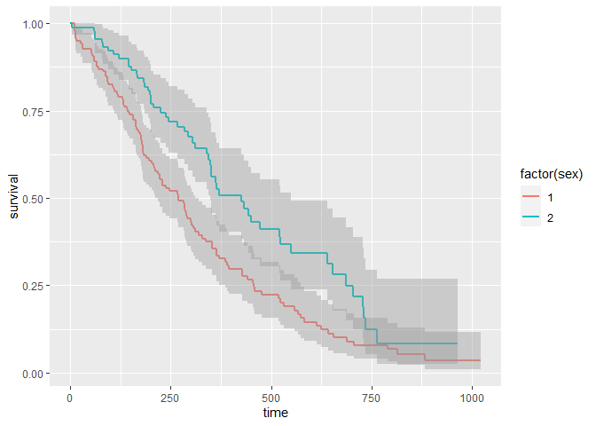
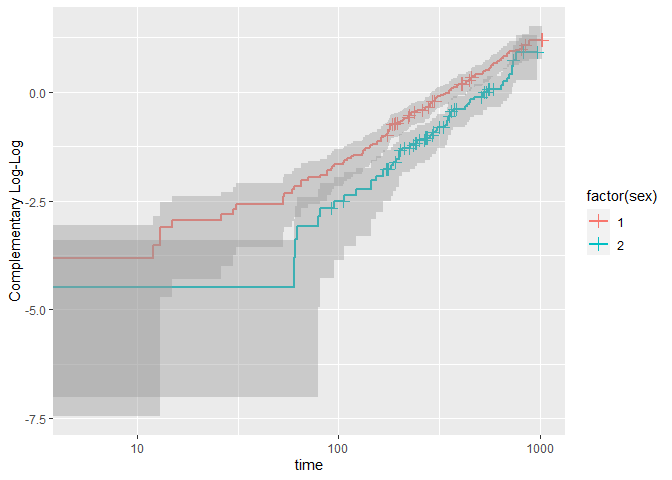

Calculate and Display Kaplan Meier Curves using ggplot2
=======================================================

Installation
------------

This version of the package is not on CRAN. It can be installed with

    install.packages("ggplot2")
    devtools::install_github("sachsmc/ggkm")

Basic usage
-----------

    library(ggkm)

    ## Loading required package: ggplot2

    ## Loading required package: survival

    ## Loading required package: scales

    ggplot(lung, aes(time = time, status = status)) + geom_km()

    ggplot(lung, aes(time = time, status = status)) + geom_km() + facet_wrap(~ sex)

    ggplot(lung, aes(time = time, status = status, color = factor(sex))) + geom_km()

Adding Tick marks
-----------------

Tick marks are displayed at censoring times that are also not event
times

    ggplot(lung, aes(time = time, status = status)) + geom_km() + geom_kmticks()

    ggplot(lung, aes(time = time, status = status)) + geom_km() + geom_kmticks(shape = 1)

Different style ribbons
-----------------------

    ggplot(lung, aes(time = time, status = status, color = factor(sex))) + geom_km() + geom_kmticks()

    ggplot(lung, aes(time = time, status = status, fill = factor(sex), color = factor(sex))) + geom_km() + geom_kmticks()

    ggplot(lung, aes(time = time, status = status, fill = factor(sex), color = factor(sex))) + 
      geom_km(alpha = .1) + stat_km(geom = "ribbon", alpha = .1, color = "black") + geom_kmticks()

Tranformations
--------------

    ggplot(lung, aes(time = time, status = status)) + geom_km(trans = "cumhaz") + 
      geom_kmticks(trans = "cumhaz") + ylab("Cumulative hazard")

    ggplot(lung, aes(time = time, status = status)) + geom_km(trans = "event") + 
      geom_kmticks(trans = "event") + ylab("Cumulative Events (CDF)")

    ## proportional hazards -> parallel lines on cloglog scale
    ggplot(lung, aes(time = time, status = status, color = factor(sex))) + geom_km(trans = "cloglog") + 
      geom_kmticks(trans = "cloglog") + ylab("Complementary Log-Log")

    ## Warning: Computation failed in `stat_km()`:
    ## arguments imply differing number of rows: 198, 200, 199

Acknowledgements
================

This package would not be possible without the following:

-   [ggplot2](http://ggplot2.org/)

License
=======

The MIT License (MIT)

Copyright (c) 2015 Michael C Sachs

Permission is hereby granted, free of charge, to any person obtaining a
copy of this software and associated documentation files (the
"Software"), to deal in the Software without restriction, including
without limitation the rights to use, copy, modify, merge, publish,
distribute, sublicense, and/or sell copies of the Software, and to
permit persons to whom the Software is furnished to do so, subject to
the following conditions:

The above copyright notice and this permission notice shall be included
in all copies or substantial portions of the Software.

THE SOFTWARE IS PROVIDED "AS IS", WITHOUT WARRANTY OF ANY KIND, EXPRESS
OR IMPLIED, INCLUDING BUT NOT LIMITED TO THE WARRANTIES OF
MERCHANTABILITY, FITNESS FOR A PARTICULAR PURPOSE AND NONINFRINGEMENT.
IN NO EVENT SHALL THE AUTHORS OR COPYRIGHT HOLDERS BE LIABLE FOR ANY
CLAIM, DAMAGES OR OTHER LIABILITY, WHETHER IN AN ACTION OF CONTRACT,
TORT OR OTHERWISE, ARISING FROM, OUT OF OR IN CONNECTION WITH THE
SOFTWARE OR THE USE OR OTHER DEALINGS IN THE SOFTWARE.
